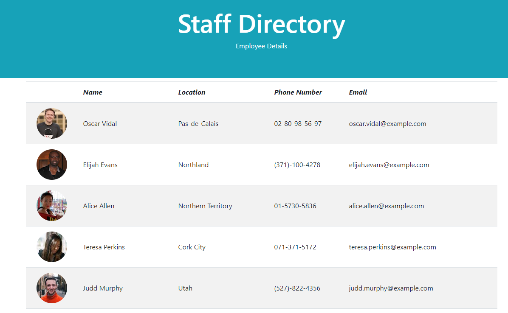

# Project Title: Employee Directory

## Description: 
* The is an employee directory using data from the Random User API.

 ## Usage: The application will be invoked by using the following

 * NPM start
 * Open browser and go to localhost:3000
 
 ## Contributing:
 * Contributions made by Jordan Mossing using various technolgies.

 ## Technologies and Features Used: 
 * ReactJS
 * JavaScript
 * Random User API
 * & More

## Screenshot:

# 

## Questions:
* Reach out to me on my GitHub page at the following Link:
* [GitHub Link](http://github.com/jmo1point0)  

* Or by email: 
* jordan.mossing@gmail.com

## Link:
*  https://github.com/jmo1point0/UserDirectory19 
 